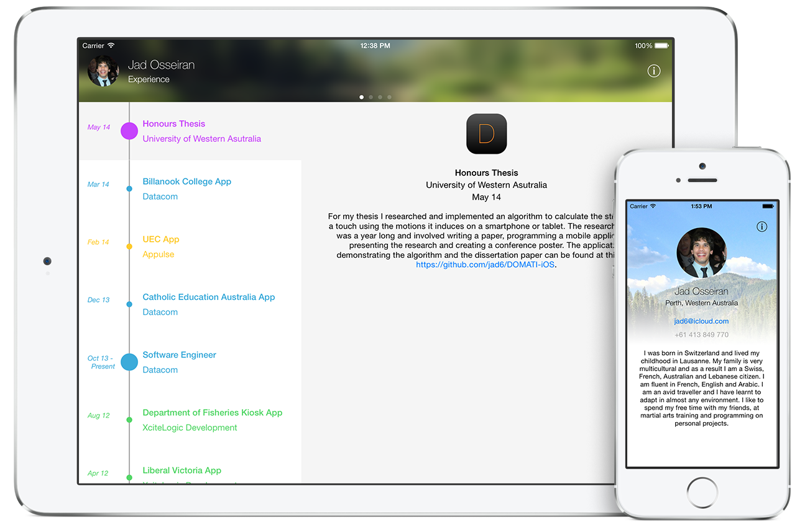

# Jad's Curriculum Vitae



## iOS Application

I am an avid iOS developer and Mac OS X dabbler who likes to think of new ways to present things. Therefore, my CV has been written in the form of a universal iOS application. The code (under a [BSD 3-Clause](http://opensource.org/licenses/BSD-3-Clause)) is [available](https://github.com/jad6/CV/releases) to download, browse and use.

### Compiling The Application

To compile the application you will need to run Mac OS X with [Xcode 5.1+](https://developer.apple.com/xcode/) installed. Then simply open the ```Jad's CV.xcodeproj``` file and run the application.

**Note:** To run it on a personal iOS device you will need to have an active full [iOS Developer](https://developer.apple.com/programs/ios/) account. Alternatively you could go through TestFlight as per the below instructions.

### TestFlight

Through [TestFlight](http://help.testflightapp.com/customer/portal/articles/402851-testflight-faq) you can download the application without the need for the App Store.

By completing the [recruitment information](http://tflig.ht/1gycrc2) I will be able to authorise you to download the application and you will have access to the latest uploaded builds.

## Old Fashioned Way

If you cannot compile or download the app, you can download [Jad's CV.pdf](https://raw.githubusercontent.com/jad6/CV/master/Jad's%20CV.pdf). However, the PDF version of my CV is slightly less informative than the app as the projects I worked on have been omitted.

## Swift & iOS 8

During WWDC 2014 Apple has released a new programming language called [Swift](https://developer.apple.com/swift/). It was released amongst **many** other cool stuff which will make a developer drop everything to learn about all about new APIs and technologies that are now available to us.

### So will this app be re-written in Swift?

For sure! First I will need to make sure I played with Swift enough and that I am confident with myself to open source the Swift code and paradigms I used. Because the language is still so new, best practices are still evolving. Therefore the once Apple and its developer community decide as a whole on a robust way of using Swift, this application will *swiftly* get re-written in Swift. 

Until then I will most likely attempt to re-write sections of this app but I have not yet decided wether I will do this on a dedicated branch or on a completely different repository as this is still bleeding edge technology.

### iOS 8

As of version 1.1.1, the application has been written and tested on iOS 7 only. I am in the middle of writing test cases (I was obviously interrupted by the WWDC 2014 excitement) and in the next release I will make sure it is compatible with the latest release of iOS 8 (beta or not).
